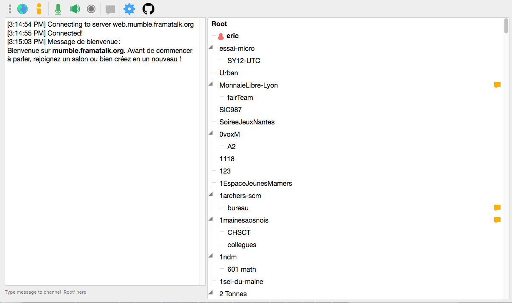

<!--
N.B.: This README was automatically generated by <https://github.com/YunoHost/apps/tree/master/tools/readme_generator>
It shall NOT be edited by hand.
-->

# Mumble Web for YunoHost

[](https://ci-apps.yunohost.org/ci/apps/mumble-web/)  

[](https://install-app.yunohost.org/?app=mumble-web)

*[Read this README in other languages.](./ALL_README.md)*

> *This package allows you to install Mumble Web quickly and simply on a YunoHost server.*  
> *If you don't have YunoHost, please consult [the guide](https://yunohost.org/install) to learn how to install it.*

## Overview

mumble-web is an HTML5 Mumble client for use in modern browsers.
The Mumble protocol uses TCP for control and UDP for voice. Running in a browser, both are unavailable to this client. Instead Websockets are used for control and WebRTC is used for voice (using Websockets as fallback if the server does not support WebRTC).

**Shipped version:** 1.3.0~ynh7

**Demo:** <https://web.mumble.framatalk.org/>

## Screenshots



## :red_circle: Antifeatures

- **Upstream not maintained**: This software is not maintained anymore. Expect it to break down over time, be exposed to unfixed security breaches, etc.

## Documentation and resources

- Official app website: <https://mumble.info>
- Official admin documentation: <https://docs.framasoft.org/fr/jitsimeet/mumble.html>
- Upstream app code repository: <https://github.com/Johni0702/mumble-web/>
- YunoHost Store: <https://apps.yunohost.org/app/mumble-web>
- Report a bug: <https://github.com/YunoHost-Apps/mumble-web_ynh/issues>

## Developer info

Please send your pull request to the [`testing` branch](https://github.com/YunoHost-Apps/mumble-web_ynh/tree/testing).

To try the `testing` branch, please proceed like that:

```bash
sudo yunohost app install https://github.com/YunoHost-Apps/mumble-web_ynh/tree/testing --debug
or
sudo yunohost app upgrade mumble-web -u https://github.com/YunoHost-Apps/mumble-web_ynh/tree/testing --debug
```

**More info regarding app packaging:** <https://yunohost.org/packaging_apps>
